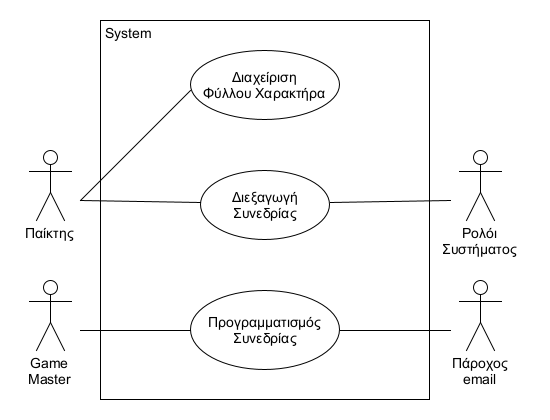
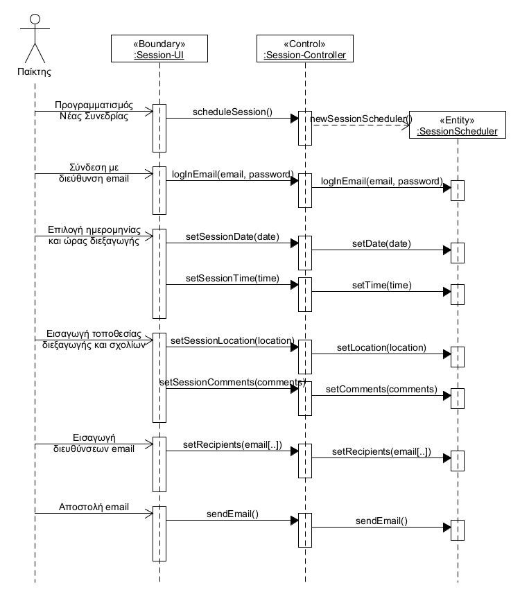

# Εισαγωγή

Η εφαρμογή «D&D Player’s Companion» είναι ένα χρήσιμο εργαλείο για την βελτίωση της εμπειρίας των παικτών Dungeons & Dragons 5ης έκδοσης. Έχει σαν στόχο την εν μέρει αυτοματοποίηση και κατ’ επέκταση απλούστευση της δημιουργίας και διαχείρισης του φύλλου χαρακτήρα για το παιχνίδι, καθώς και την ενίσχυση της εμπειρίας του παίκτη. Προορίζεται για τόσο αρχάριους όσο και έμπειρους παίκτες του παιχνιδιού και τις ομάδες τους.

## Εμβέλεια

Το λογισμικό επιτρέπει στους χρήστες:
- να δημιουργούν, να αποθηκεύουν, να βλέπουν και να επεξεργάζονται πολλαπλά φύλλα χαρακτήρα,
- να εισάγουν στοιχεία στο φύλλο χαρακτήρα τους, ώστε να θπολογίζονται και να ενημερώνονται αυτόματα τα κατάλληλα πεδία του φύλλου χαρακτήρα,
- να ξεκινούν συνεδρίες που να μπορούν με το φύλλο χαρακτήρα τους να πραγματοποιούν ρίψεις ζαριών με τους κατάλληλους πολλαπλασιαστές, να ενημερώνουν κατάλληλα το φύλλο χαρακτήρα τους και να κρατούν αυτόματα διάφορα στατιστικά τους,
- να προγραμματίζουν συνεδρίες, ενημερώνοντας άλλους παίκτες μέσω email.

Το λογισμικό **ΔΕΝ**:
- αποτελεί εναλλακτικό των βιβλίων κανόνων, αλλά ένα σχετικό βοήθημα,
- αποτελεί εναλλακτικό του Game Master, καθώς δεν τρέχει συνεδρίες μόνο του.

## Ορισμοί ακρώνυμα και συντομογραφίες

| Ακρώνυμα | Ερμηνεία            |
| -------- | ------------------- |
| D&D      | Dungeon And Dragons |
| GM/Gm    | Game Master         |

| Ορολογία        | Ερμηνεία                                                                                                                |
| --------------- | ----------------------------------------------------------------------------------------------------------------------- |
| Game Master     | Είναι ο διοργανωτής του παιχνιδιού και ο συμμετέχων που είναι υπεύθυνος για τη δημιουργία των λεπτομερειών και κανόνων. |
| Φύλλο Χαρακτήρα | Το φύλλο χαρακτήρα του D&D αφορά όλες τις λεπτομέρειες και τα στατιστικά στοιχεία του χαρακτήρα.                        |

## Κανόνες

1) Ύπαρξη κλάσης για ρόλο (πχ κλερικός, μάγος, μαχητής κλπ)

2) Ύπαρξη κλάσης για φυλή (πχ νάνος, άνθρωπος, ξωτικό κλπ)

3) Ο κάθε χαρακτήρας διαθέτει χαρακτηριστικά (πχ strength, armor κλπ) 

4) Ρήψη 4 ζαριών & καταμέτρηση σκόρ για κάθε χαρακτήρα. Το σκόρ θα'ναι το αποτέλεσμα της άθροισης των 3 μεγαλύτερων (εκ των 4) ζαριών, το οποίο θα προστίθεται ως συντελεστής σε 1 χαρακτηριστικό του χαρακτήρα που επιθυμεί(πχ στη δύναμη)

5) Ο παίκτης έχει την επιλογή να διαλέξει το σκόρ είτε μέσω της διαδικασίας των ζαριών είτε διαλέγει από μόνος του τις τιμές που θα'χει το κάθε χαρακτηριστικό. Δηλαδή, διαλέγει έναν αριθμό για κάθε χαρακτηριστικό. Ο αριθμός αυτός μπορεί να κυμαίνεται από 1 εώς και 30. Πχ ο παίκτης Α διαλέγει να προσθέσει στη δύναμη του χαρακτήρα του σκόρ 14 & στην αντοχή σκόρ 22 (σ'αυτήν την περίπτωση δεν δικαιούται να διαλέξει το σκόρ μέσω ζαριών)

Ο χρήστης επιλέγει μόνο αυτά σαν χαρακτηριστικά

## Αναφορές

\[*Γράφουμε αν υπάρχουμε αναφορές σε άλλα έγγραφα (μελέτη σκοπιμότητας, ΕΠΑΣ, επιχειρησιακά μοντέλα κλπ). Σε περίπτωση που κάποια πληροφορία περιλαμβάνεται σε άλλο έγγραφο γίνεται η αναφορά στο άλλο έγγραφο και δεν επαναλαμβάνεται στο ΕΠΑΛ).*\]

## Επισκόπηση

\[*Γράφουμε πως οργανώνεται το υπόλοιπο έγγραφο*\]

# Συνολική περιγραφή

## Επισκόπηση μοντέλου περιπτώσεων χρήσης

\[*Εισάγουμε το διάγραμμα περιπτώσεων χρήσης. Βλέπε σχήμα 3-19 του παραδείγματος 3-11 στη σελίδα 168 του βιβλίου.*

*Εισάγουμε έναν πίνακα με τους κωδικούς, τους τίτλους και μία σύντομη περιγραφή των περιπτώσεων χρήσης. Βλέπε πίνακα 3-8 του παραδείγματος 3-11 στη σελίδα 168 του βιβλίου*\]

## Υποθέσεις και εξαρτήσεις

Για την εύρυθμη λειτουργία του λογισμικού υποθέτουμε τα εξής:
- Το ρολόι συστήματος κάθε συσκευής είναι συγχρονισμένο με των άλλων.

# Ειδικές Απαιτήσεις 

## Περιπτώσεις χρήσης

### Οι ενδιαφερόμενοι και οι ανάγκες τους

\[*Ένας πίνακας των ενδιαφερομένων (stakeholders) με τις ανάγκες τους. Βλέπε πίνακα 3-6 του παραδείγματος 3-2 στη σελίδα 138 του βιβλίου.*\]

### Actors του συστήματος

\[*Ένα πίνακας με του actors του συστήματος. Βλέπε πίνακας 3-7 παραδείγματος 3-11 στη σελίδα 167 του βιβλίου.*\]

### Περιγραφές περιπτώσεων χρήσης

#### [ΠΧ1 Διαχείριση Φύλλου Χαρακτήρα](uc1-character-sheet-management.md)

#### [ΠΧ2 Διεξαγωγή συνεδρίας](uc2-run-session.md)

#### [ΠΧ3 Προγραμματισμός συνεδρίας](uc3-schedule-session.md)

## Συμπληρωματικές προδιαγραφές

\[*Οι επόμενες ενότητες περιέχουν όλες τις μη λειτουργικές απαιτήσεις και τους περιορισμούς σχεδίασης και υλοποίησης.*\]

### Απαιτήσεις διεπαφών

#### Διεπαφές χρήστη

\[*Βλέπε πίνακα 5-2 του παραδείγματος 5-1 στη σελίδα 305*\]

#### Διεπαφές υλικού

\[*Βλέπε πίνακα 5-2 του παραδείγματος 5-1 στη σελίδα 305*\]

#### Διεπαφές επικοινωνίας

\[*Βλέπε πίνακα 5-2 του παραδείγματος 5-1 στη σελίδα 305*\]

#### Διεπαφές λογισμικού

\[*Βλέπε πίνακα 5-2 του παραδείγματος 5-1 στη σελίδα 305*\]

### Περιορισμοί σχεδίασης και υλοποίησης

\[*Βλέπε πίνακα 5-3 του παραδείγματος 5-1 στη σελίδα 305*\]

### Ποιοτικά χαρακτηριστικά

#### Απόδοση

\[*Βλέπε πίνακα 5-4 του παραδείγματος 5-1 στη σελίδα 306*\]

#### Διαθεσιμότητα

\[*Βλέπε πίνακα 5-4 του παραδείγματος 5-1 στη σελίδα 306*\]

#### Ασφάλεια

\[*Βλέπε πίνακα 5-4 του παραδείγματος 5-1 στη σελίδα 306*\]

#### Ευελιξία

\[*Βλέπε πίνακα 5-4 του παραδείγματος 5-1 στη σελίδα 306*\]

#### Ευχρηστία

\[*Βλέπε πίνακα 5-4 του παραδείγματος 5-1 στη σελίδα 306*\]

# Υποστηρικτικό υλικό

## Μοντέλο πεδίου

## Ανάλυση περιπτώσεων χρήσης
--------------------------

### Κλάσεις ανάλυσης

\[*Εισάγουμε ένα διάγραμμα κλάσεων με την αρχική έκδοση των κλάσεων λογισμικού. Βλέπε σχήμα 4-104 του παραδείγματος 4-14 στη σελίδα 258 του βιβλίου*\]

Κλάσεις ανάλυσης που έχουν προκύψει από την ανάλυση των περιπτώσεων χρήσης *Διαχείριση Λογαριασμού* και *Διαχείριση Στοιχείων Πελάτη*.

### Συμπεριφορές

#### Δημιουργία Φύλλου Χαρακτήρα

#### Ρίψη ζαριών

#### Προγραμματισμός Συνεδρίας

## Άλλα μοντέλα
------------

\[*Άλλα μοντέλα όπως για παράδειγμα διαγράμματα μηχανής καταστάσεων, πίνακες απόφασης κλπ. Βλέπε παράδειγμα 4-6 του βιβλίου*\]

## Επιχειρησιακοί κανόνες

\[*Ένας πίνακας με του επιχειρησιακούς κανόνες. Βλέπε πίνακα 3-4 του παραδείγματος 3-1 στη σελίδας 133 του βιβλίου.*\]

| Επιχειρησιακοί κανόνες | Περιγραφή                                                                |
| :--------------------- | :----------------------------------------------------------------------- |
| ΕΚ1                    | O Αριθμός Δελτίου Ταυτότητας και το ΑΦΜ είναι μοναδικά για κάθε πελάτη   |
| ΕΚ2                    | Όλα τα στοιχεία του πελάτη είναι υποχρεωτικά, με εξαίρεση τον αριθμό Fax |
| ΕΚ3                    | Η ηλικία του πελάτη θα πρέπει να είναι μεγαλύτερη των 18 ετών            |