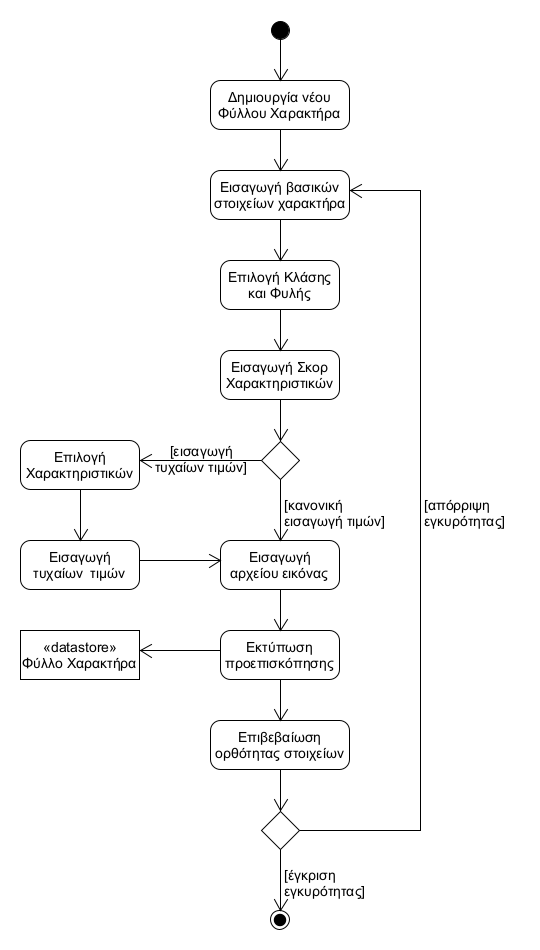

# ΠΧ1. Διαχείριση Φύλλου Χαρακτήρα

**Πρωτεύων Actor**: Παίκτης

**Ενδιαφερόμενοι**:
- **Παίκτης**: Θέλει να δημιουρήσει ή/και να ενημερώσει ένα Φύλλο Χαρακτήρα.

## Βασική Ροή

### Α) Δημιουργία νέου Φύλλου Χαρακτήρα
1. Ο παίκτης επιλέγει τη δημιουργία νέου Φύλλου Χαρακτήρα.
2. Ο παίκτης εισάγει τα βασικά στοιχεία του χαρακτήρα (ονοματεπώνυμο, φύλο κλπ).
3. Ο παίκτης επιλέγει την κλάση και την φυλή του χαρακτήρα.
4. Ο παίκτης εισάγει το σκορ κάθε χαρακτηριστικού του χαρακτήρα.
5. Ο παίκτης αν επιθυμεί επιλέγει ένα αρχείο εικόνας για τον χαρακτήρα.
6. Το σύστημα εκτυπώνει μία προεπισκόπηση του Φύλλου Χαρακτήρα.
7. Ο παίκτης επιβεβαιώνει την ορθότητα των στοιχείων.
8. Το σύστημα δημιουγεί το Φύλλο Χαρακτήρα και το αποθηκεύει.

**Εναλλακτικές Ροές**

*4α. Ο παίκτης επιθυμεί να εισάγει τυχαίες τιμές για το σκορ χαρακτηριστικού.*
1. Ο παίκτης επιλέγει για ποια χαρακτηριστικά θέλει να υπολογιστεί τυχαία τιμή.
2. Το σύστημα επιστρέφει αντίστοιχο πλήθος τυχαίων τιμών και τις εισάγει στο σκορ των αντίστοιχων χαρακτηριστικών.
3. Η περίπτωση χρήσης συνεχίζει στο βήμα 5 της βασικής ροής.

*7α. Ο χρήστης απορρίπτει την ορθότητα των στοιχείων.*
1. Η περίπτωση χρήσης επιστρέφει στο βήμα 2 της βασικής ροής.

### Β) Ενημέρωση υπάρχοντος Φύλλου Χαρακτήρα
1. Ο παίκτης επιλέγει ένα υπάρχον Φύλλο Χαρακτήρα.
2. Το σύστημα εκτυπώνει το Φύλλο Χαρακτήρα.
3. Ο παίκτης επιλέγει την ενημέρωση Φύλλου Χαρακτήρα.
4. Ο παίκτης επιλέγει το πεδίο που θέλει να επεξεργαστεί.
5. Ο παίκτης εισάγει την ενημερωμένη τιμή για το αντίστοιχο πεδίο.
6. Το σύστημα εκτυπώνει μια προεπισκόπηση του ενημερωμένου Φύλλου χαρακτήρα.
7. Ο παίκτης επιλέγει πως δεν επιθυμεί να ενημερώσει άλλα πεδία.
8. Ο παίκτης επιβεβαιώνει τις αλλαγές.
9. Το σύστημα ενημερώνει το υπάρχον Φύλλο Χαρακτήρα.

**Εναλλακτικές Ροές**

*3α. Ο παίκτης δεν επιθυμεί να επεξεργαστεί το Φύλλο Χαρακτήρα.*
1. Η περίπτωση χρήσης τερματίζει.

*7α. Ο παίκτης επιθυμεί να ενημερώσει κι άλλα πεδία.*
1. Η περίπτωση χρήσης επιστρέφει στο βήμα 4 της βασικής ροής.

*8α. Ο χρήστης απορρίπτει τις αλλαγές.*
1. Η περίπτωση χρήσης τερματίζει.

## Διαγράμματα

### Διάγραμμα δραστηριότητας - Δημιουργία νέου Φύλλου Χαρακτήρα

### Διάγραμμα δραστηριότητας - Ενημέρωση υπάρχοντος Φύλλου Χαρακτήρα
