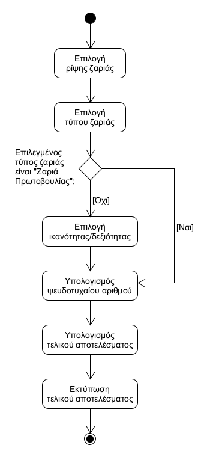

# ΠΧ2. Διεξαγωγή συνεδρίας

**Πρωτεύων Actor**: Παίκτης

**Ενδιαφερόμενοι**:
- **Παίκτης**: Θέλει να ξεκινήσει και να παίξει σε μια συνεδρία.

**Προϋποθέσεις**:
- Ο παίκτης έχει δημιουργήσει τουλάχιστον ένα Φύλλο Χαρακτήρα.

## Βασική Ροή

### Α) Έναρξη νέας Συνεδρίας
1. Ο παίκτης επιλέγει τη έναρξη συνεδρίας.
2. Το σύστημα εμφανίζει τους χαρακτήρες που έχει δημιουργήσει ο παίκτης.
3. Ο παίκτης επιλέγει τον χαρακτήρα με τον οποίο επιθυμεί να παίξει σε αυτή τη συνεδρία.

### Β) Ρίψη ζαριών
1. Ο παίκτης επιλέγει την ρίψη ζαριάς.
2. Ο παίκτης επιλέγει τον τύπο ζαριάς.
3. Ο παίκτης επιλέγει την αντίστοιχη ικανότητα ή δεξιότητα.
4. Το σύστημα υπολογίζει έναν ψευδοτυχαίο αριθμό.
5. Το σύστημα υπολογίζει το τελικό αποτέλεσμα.
6. Το σύστημα εκτυπώνει το τελικό αποτέλεσμα της ζαριάς.

**Εναλλακτικές Ροές**

*3α. Ο παίκτης έχει επιλέξει ως τύπο ζαριάς τη "Ζαριά Πρωτοβουλίας".*
1. Το βήμα παραλείπεται και η περίπτωση χρήσης συνεχίζει στο βήμα 4 της βασικής ροής.

### Γ) Προσθήκη πόντων εμπειρίας
1. Ο παίκτης επιλέγει την προσθήκη πόντων εμπειρίας.
2. Ο παίκτης εισάγει τον αριθμό των πόντων που επιθυμεί να προσθέσει.
3. Το σύστημα εκτυπώνει μήνυμα ότι οι πόντοι εμπειρίας αρκούν για να περάσει ο χαρακτήρας στο επόμενο επίπεδο.
4. Το σύστημα ενημερώνει το αντίστοιχο πεδίο πόντων εμπειρίας του Φύλλο Χαρακτήρα.

**Εναλλακτικές Ροές**

*3α. Οι πόντοι εμπειρίας δεν αρκούν για να περάσει ο χαρακτήρας στο επόμενο επίπεδο.*
1. Το βήμα παραλείπεται και η περίπτωση χρήσης συνεχίζει στο βήμα 4 της κανονικής ροή.

## Διαγράμματα

### Διάγραμμα δραστηριότητας - Ρίψη ζαριών
