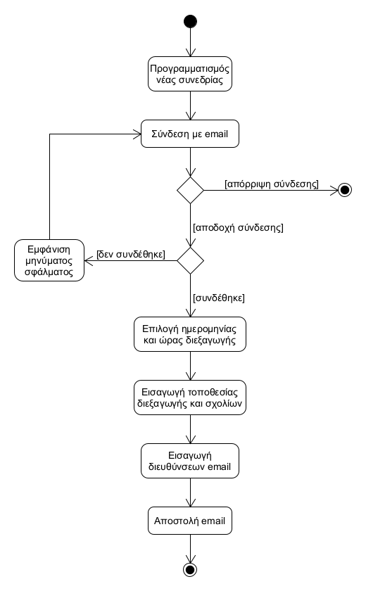

# ΠΧ5. Προγραμματισμός Συνεδρίας

**Πρωτεύων Actor**: Game Master

**Ενδιαφερόμενοι**:
- **Game Master**: Θέλει να προγραμματίσει νέα συνεδρία και να ενημερώσει αντίστοιχα τους παίκτες.
- **Παίκτης**: Θέλει να ενημερωθεί για τις ερχόμενες προγραμματισμένες συνεδρίες.

**Προϋποθέσεις**: Ο Game Master γνωρίζει τις email διευθύνσεις των παικτών.

## Βασική Ροή

### Προγραμματισμός Νέας Συνεδρίας
1. Ο Game Master επιλέγει τον προγραμματισμό νέας συνεδρίας.
2. Ο Game Master συνδέεται με τη διεύθυνση email του.
3. Ο Game Master επιλέγει την ημερομηνία και την ώρα διεξαγωγής της συνεδρίας.
4. Ο Game Master εισάγει την τοποθεσία διεξαγωγής της συνεδρίας και, αν επιθυμεί, κάποιο σχετικό σχόλιο.
5. Ο Game Master εισάγει τις email διευθύνσεις των παικτών που επιθυμεί να ενημερώσει.
6. Το σύστημα αποστέλλει ένα ενημερωτικό email με τις πληροφορίες που εισήγαγε ο Game Master στις αντίστοιχες διευθύνσεις.

## Εναλλακτικές Ροές

*2α. Ο Game Master επιλέγει να μην συνδεθεί με τη διεύθυνση email του.*
1. Η περίπτωση χρήσης τερματίζει.

*2β. Ο Game Master αδυνατεί να συνδεθεί με τη διε΄ύθυνση email του.*
1. Το σύστημα εμφανίζει μήνυμα σφάλματος.
2. Η περίπτωση χρήσης επαναλαμβάνει το βήμα 2.

## Διαγράμματα

